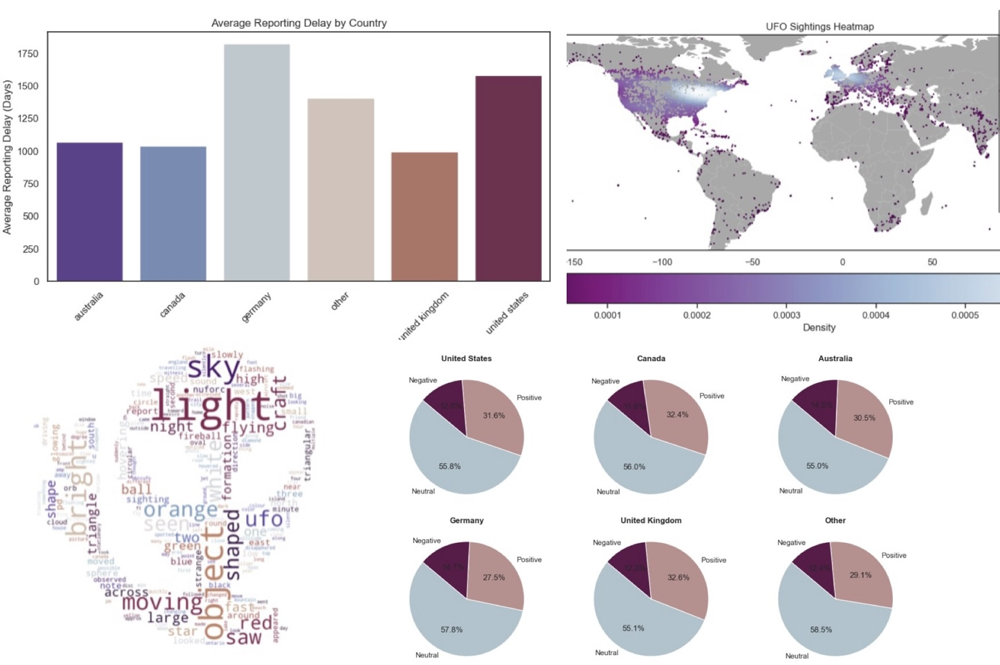

# UFO Sightings Analysis
The Relationship Between UFOs, Location, Time, and Human Emotion

    

## Motivation
**Goal:** I want to learn more about how factors like time, location, and human emotion affect the rate at which UFO sightings are reported.

This project is inspired by the project that sparked my interest in data analysis. The original project was done in R and it remains my favourite school project to this day. My professor even used it (and still uses it) as an example of a good project when teaching this class.
In this rendition of the project, I explored a UFO Sightings database and re-cleaned and re-analyzed it with my new skills.    

## Task List
1. Data Cleaning in SQL ([UFO_Project_Part1.sql](https://github.com/johannaschmidle/UFO-Project/blob/main/UFO_Project_Part1.sql))
2. Data Exploration and Modeling Done in Python ([UFO_Project_Part2_Python.ipynb](https://github.com/johannaschmidle/UFO-Project/blob/main/UFO_Project_Part2_Python.ipynb))

## Things you can find in my project:
- Analysis thinking and problem-solving
- Researched conclusions (and fun speculative conclusions)
- Text analysis
- Location analysis
- Time analysis
- K-means clustering
- Density calculation using Gaussian Kernel Density Estimation (KDE)
- Sentiment and emotion analysis (tokenization, removal of stopwords, speech tagging, stemming, lemmatization)

## Summary of Insights:
The full summary can be found at the bottom of my [project file](https://github.com/johannaschmidle/UFO-Project/blob/main/UFO_Project_Part2_Python.ipynb). 
### Time
#### Sightings and Reporting Over the Years 
1. Over time there is an increase in UFO **sighting** rates, likely due to internet access, pop culture events, and conspiracy theories.
2. Over the years **reporting** rates fluctuate. Spikes, such as around 2012, may be due to specific events like the end-of-the-world theory.
   
**Findings**
- Large spike in sightings and reportings after 1995.
- Significant activity in Canada (2003-2007).
- Spike around 2012.
#### Reporting Delays
1. Most post about an encounter immediately.
2. Reporting delays differ by country. Germany takes the longest, the UK the quickest. The US takes surprisingly long.
3. Different UFO shapes affect reporting delay. Distinct shapes prompt quicker reports; general shapes take longer.
4. Strong emotions like happiness, fear, and anger lead to quicker reports.
   
**Findings**
- Fastest to slowest reporting time (Countries): UK, Canada, Australia, US, Germany.
- Fastest to slowest reporting time (Emotions): Angry, Happy, Fear, Sad, Surprise.
- Distinct shapes were reported fastest; general shapes were reported slowest.
### Location
#### Sightings on a World Map
1. Sightings are concentrated in first-world countries, especially along coastlines.
2. Areas where sightings are sparse show clusters of sightings.
   
**Findings**
- Aliens prefer coastal areas.
- Clustering suggests aliens are real.
#### Sightings vs Time of Year (Northern and Southern Hemisphere)
1. Sightings are most frequent in the **northern hemisphere** during _June_, July, August, and September.
2. Sightings are most frequent in the **southern hemisphere** during January, March, _June_, and December.
    
**Findings**
- June is the most popular month for sightings.
### Human Emotion (Includes Sentiment)
#### Location and Sentiment
1. Negative and positive sentiments are more concentrated in popular areas; neutral sentiments are more spread out.
2. Sentiments are distributed similarly across different countries.
    
**Findings**
- Most to least popular sentiment: Neutral, Positive, Negative.
- UK and Canada have the highest positive sentiments.
- Australia has the highest negative sentiments.
#### Location and Emotion
1. Emotions appear randomly spread out on a world map, with clusters of surprised people in the US and Europe.
2. Happiness is the most popular emotion in every country; surprise is the least popular.
3. Emotion are distributed similarly across different countries.
   
**Findings**
- Emotions ranked: Happy, Scared, Angry, Sad, Surprised.
- **Happy**: Most in Germany, least in Australia & US.
- **Fear**: Most in the US, least in the UK.
- **Angry**: Most in Germany.
- **Sad**: Most in Canada.
- **Surprise**: Least in the UK.
#### Feelings about UFO Shapes
1. Most shapes elicit neutral sentiments; diamond shapes are an exception.
2. When it comes to shape and emotions, the results are consistent with sentiment findings; flashes elicit neutral reactions.
    
**Findings**
- Shape "light" has the highest positive sentiment.
- Diamond shapes are likely to get positive reactions.
- Teardrop shapes elicit mixed reactions.
### Comment Analysis
1. Light, object, and sky are the **most** used words to describe UFO encounters.
2. The top 5 words are similar across countries.
3. The top 5 words reveal more information about UFOs. They provide insights into the color and motion of UFOs.
   
**Findings**
- UFOs often move quickly.
- Common colors: orange, white, red.
- Sightings often occur at night.
- UFOs can be large.
  
## Data
The dataset used in this project is available publicly on Kaggle: [https://www.kaggle.com/datasets/NUFORC/ufo-sightings](https://www.kaggle.com/datasets/NUFORC/ufo-sightings)

## Technologies
- SQL
- Python (Pandas, nltk, Seaborn, matplotlib)
